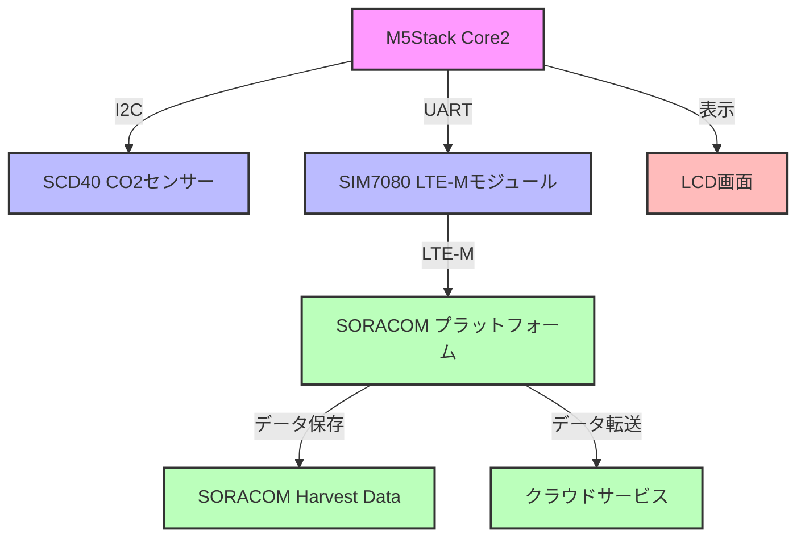
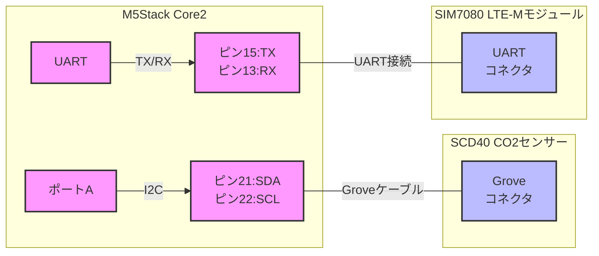

# M5stack-CO2Monitor-LTEM

ポータブルCO2モニターとLTE-M通信によるリモートデータ収集システム

## 概要

このプロジェクトは、M5Stack Core2を使用した研究用ポータブルCO2モニターです。SCD40 CO2センサーでCO2濃度、温度、湿度を測定し、LTE-M通信（SIM7080モジュール）を使用してSORACOMプラットフォームにデータをリアルタイムで送信します。測定データはM5Stack本体の画面にも表示されます。

## 機能

- CO2濃度、温度、湿度の測定（SCD40センサー使用）
- 測定データのM5Stack LCDへのリアルタイム表示
- LTE-M通信によるSORACOMプラットフォームへのデータ送信
- 10秒ごとのデータ測定・送信
- バッテリー駆動によるポータブル運用（M5Stack Core2内蔵バッテリー使用）

## システム構成図



## 必要なハードウェア

- [M5Stack Core2](https://shop.m5stack.com/products/m5stack-core2-esp32-iot-development-kit)
- [SCD40 CO2センサー](https://www.sparkfun.com/products/18365)
- SIM7080 LTE-Mモジュール
- SORACOMのSIMカード
- Groveケーブル（SCD40接続用）

## ハードウェア接続図



## 必要なソフトウェア・ライブラリ

- [PlatformIO](https://platformio.org/)
- 使用ライブラリ:
  - m5stack/M5Stack@^0.4.6
  - sparkfun/SparkFun SCD4x Arduino Library@^1.1.2
  - Seeed Arduino BME68x
  - TinyGSM
  - arduino-libraries/ArduinoHttpClient@^0.4.0

## 開発環境のセットアップ手順

1. 開発環境のインストール
   - [Visual Studio Code](https://code.visualstudio.com/)をダウンロードしてインストール
   - VSCodeの拡張機能マーケットプレイスから「PlatformIO IDE」をインストール
   - VSCodeを再起動してPlatformIOを有効化

2. プロジェクトのセットアップ
   - このリポジトリをクローン：`git clone https://github.com/yourusername/M5stack-CO2Monitor-LTEM.git`
   - または、新規プロジェクトを作成：
     - PlatformIO Home画面で「New Project」をクリック
     - プロジェクト名を「M5stack-CO2Monitor-LTEM」に設定
     - ボードに「M5Stack Core2」を選択
     - フレームワークに「Arduino」を選択
     - 「Finish」をクリック
     - `platformio.ini`ファイルを開き、必要なライブラリを追加：
       ```
       lib_deps = 
           m5stack/M5Stack@^0.4.6
           sparkfun/SparkFun SCD4x Arduino Library@^1.1.2
           https://github.com/Seeed-Studio/Seeed_Arduino_BME68x.git
           https://github.com/vshymanskyy/TinyGSM.git
           arduino-libraries/ArduinoHttpClient@^0.4.0
       ```
     - `src/main.cpp`にプロジェクトのソースコードをコピー

3. ハードウェアの接続
   - SCD40センサーをGroveケーブルでM5Stack Core2のポートAに接続
   - SIM7080モジュールをM5Stack Core2のピン13(RX)と15(TX)に接続
   - SORACOMのSIMカードをSIM7080モジュールに挿入

4. ビルドと書き込み
   - M5Stack Core2をUSBケーブルでPCに接続
   - PlatformIOのサイドバーから「Build」アイコンをクリックしてプロジェクトをビルド
   - 正常にビルドできたら「Upload」アイコンをクリックしてM5Stack Core2にプログラムを書き込み

## SORACOMの設定

1. SORACOMコンソールでSIMを登録・アクティベート
   - [SORACOM User Console](https://console.soracom.io/)にログイン
   - 「SIM登録」からSIMカードのID/パスワードを入力して登録
   - SIMのステータスが「準備完了」になっていることを確認

2. SORACOM Harvest Dataを有効化（データ保存用）
   - 登録したSIMを選択し、「SORACOM Harvest」を有効化
   - データ保存期間などの設定を必要に応じて調整

3. 必要に応じてSORACOM BeamやFunnelを設定（他のクラウドサービスへのデータ転送用）
   - 「SORACOM Beam」または「SORACOM Funnel」を有効化
   - 転送先のクラウドサービス情報を設定

## データフォーマット

デバイスはUDPでバイナリデータを送信します。データ形式は以下の通りです：
- CO2濃度: float (4バイト、リトルエンディアン)
- 温度: float (4バイト、リトルエンディアン)
- 湿度: float (4バイト、リトルエンディアン)

合計12バイトのデータが10秒ごとに送信されます。

SORACOM Harvest Dataでのパース設定：
- co2::float:32:little-endian
- temp::float:32:little-endian
- humidity::float:32:little-endian

## トラブルシューティング

- デバイスが起動しない場合: 
  - バッテリー残量を確認し、必要に応じて充電してください
  - USBケーブルが正しく接続されているか確認してください

- センサーエラーが表示される場合: 
  - SCD40センサーの接続を確認してください
  - I2Cアドレスが0x62であることを確認してください
  - Groveケーブルが損傷していないか確認してください

- ネットワーク接続エラーが表示される場合: 
  - SIMカードが正しく挿入されているか確認
  - SORACOMでSIMが正しく設定されているか確認
  - 電波状況を確認
  - モデムの初期化に失敗している場合は、リセットボタンを押して再起動してください

- データが送信されない場合:
  - シリアルモニターでデバッグ情報を確認
  - SORACOMコンソールでSIMの通信状況を確認
  - UDPソケットの開設に失敗している可能性があるため、デバイスを再起動してください

## ライセンス

このプロジェクトはMITライセンスで公開されています。