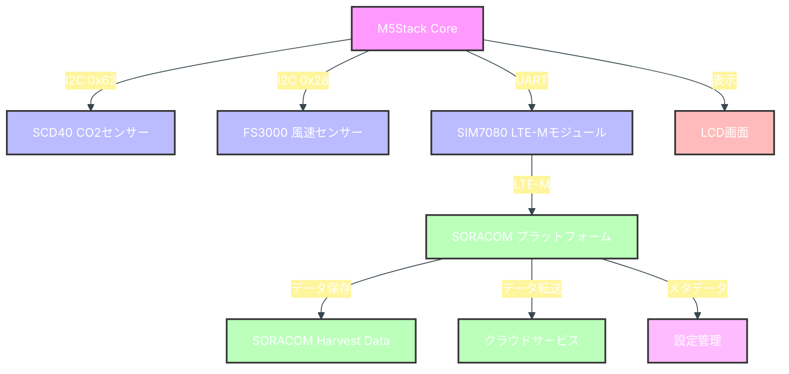
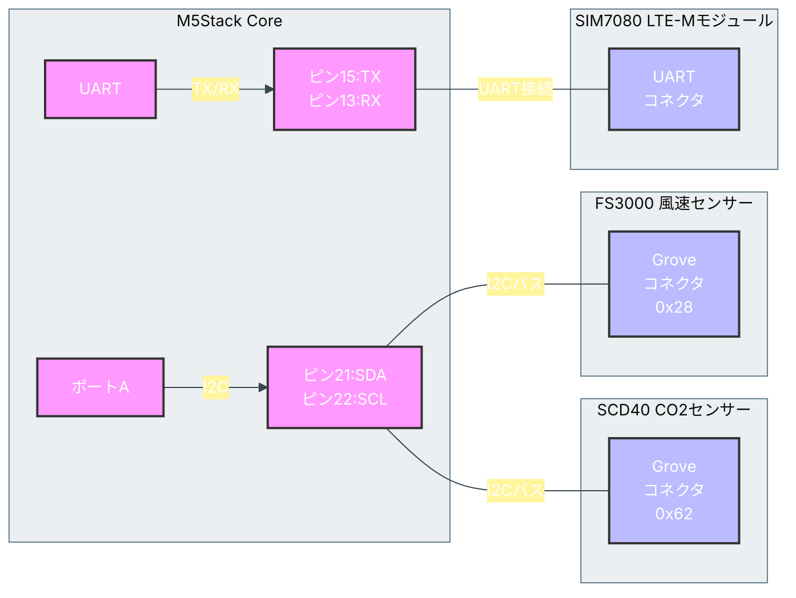

# M5stack-CO2Monitor-LTEM

ポータブルCO2・風速モニターとLTE-M通信によるリモートデータ収集システム

## 概要

このプロジェクトは、M5Stack Coreを使用した研究用ポータブル環境モニターです。SCD40 CO2センサーでCO2濃度、温度、湿度を測定し、FS3000センサーで風速を測定します。LTE-M通信（SIM7080モジュール）を使用してSORACOMプラットフォームにデータをリアルタイムで送信します。測定データはM5Stack本体の画面にも表示されます。

## 機能

- **CO2濃度、温度、湿度の測定**（SCD40センサー使用）
- **風速の測定**（FS3000センサー使用）
- 測定データのM5Stack LCDへのリアルタイム表示
- LTE-M通信によるSORACOMプラットフォームへのデータ送信
- 設定可能なデータ測定・送信間隔（SORACOMメタデータ経由）
- バッテリー駆動によるポータブル運用（M5Stack内蔵バッテリー使用）
- I2Cデバイス自動スキャン機能
- 詳細なデバッグ情報出力

## システム構成図



## 必要なハードウェア

- [M5Stack Core](https://shop.m5stack.com/products/m5stack-core-esp32-development-kit) または [M5Stack Core2](https://shop.m5stack.com/products/m5stack-core2-esp32-iot-development-kit)
- [SCD40 CO2センサー](https://www.sparkfun.com/products/18365) (I2Cアドレス: 0x62)
- [FS3000 風速センサー](https://www.sparkfun.com/products/18377) (I2Cアドレス: 0x28)
- SIM7080 LTE-Mモジュール
- SORACOMのSIMカード
- Groveケーブル（センサー接続用）

## ハードウェア接続図



## 必要なソフトウェア・ライブラリ

- [PlatformIO](https://platformio.org/)
- 使用ライブラリ:
  - m5stack/M5Stack@^0.4.6
  - sparkfun/SparkFun SCD4x Arduino Library@^1.1.2
  - sparkfun/SparkFun_FS3000_Arduino_Library@^1.0.5
  - Seeed Arduino BME68x
  - TinyGSM
  - arduino-libraries/ArduinoHttpClient@^0.4.0
  - bblanchon/ArduinoJson@^6.21.3

## 開発環境のセットアップ手順

1. **開発環境のインストール**
   - [Visual Studio Code](https://code.visualstudio.com/)をダウンロードしてインストール
   - VSCodeの拡張機能マーケットプレイスから「PlatformIO IDE」をインストール
   - VSCodeを再起動してPlatformIOを有効化

2. **プロジェクトのセットアップ**
   - このリポジトリをクローン：`git clone https://github.com/yourusername/M5stack-CO2Monitor-LTEM.git`
   - または、新規プロジェクトを作成：
     - PlatformIO Home画面で「New Project」をクリック
     - プロジェクト名を「M5stack-CO2Monitor-LTEM」に設定
     - ボードに「M5Stack Core ESP32」を選択
     - フレームワークに「Arduino」を選択
     - 「Finish」をクリック
     - `platformio.ini`ファイルを開き、必要なライブラリを追加：
       ```ini
       [env:m5stack-core-esp32]
       platform = espressif32
       board = m5stack-core-esp32
       framework = arduino
       board_build.flash_size = 4MB
       board_build.partitions = default.csv
       build_flags =
           -DCORE_DEBUG_LEVEL=5
           -DDEBUG_ESP_CORE
           -DDEBUG_ESP_FLASH
       monitor_speed = 115200
       monitor_filters = esp32_exception_decoder
       upload_port = /dev/cu.SLAB_USBtoUART
       lib_deps =
           m5stack/M5Stack@^0.4.6
           sparkfun/SparkFun SCD4x Arduino Library@^1.1.2
           sparkfun/SparkFun_FS3000_Arduino_Library@^1.0.5
           https://github.com/Seeed-Studio/Seeed_Arduino_BME68x.git
           https://github.com/vshymanskyy/TinyGSM.git
           arduino-libraries/ArduinoHttpClient@^0.4.0
           bblanchon/ArduinoJson@^6.21.3
       ```
     - `src/main.cpp`にプロジェクトのソースコードをコピー

3. **ハードウェアの接続**
   - SCD40センサーをGroveケーブルでM5Stack CoreのポートAに接続
   - FS3000センサーを同じI2Cバス（ポートA）に接続
   - SIM7080モジュールをM5Stack Coreのピン13(RX)と15(TX)に接続
   - SORACOMのSIMカードをSIM7080モジュールに挿入

4. **ビルドと書き込み**
   - M5Stack CoreをUSBケーブルでPCに接続
   - PlatformIOのサイドバーから「Build」アイコンをクリックしてプロジェクトをビルド
   - 正常にビルドできたら「Upload」アイコンをクリックしてM5Stack Coreにプログラムを書き込み

## SORACOMの設定

1. **SORACOMコンソールでSIMを登録・アクティベート**
   - [SORACOM User Console](https://console.soracom.io/)にログイン
   - 「SIM登録」からSIMカードのID/パスワードを入力して登録
   - SIMのステータスが「準備完了」になっていることを確認

2. **SORACOM Harvest Dataを有効化（データ保存用）**
   - 登録したSIMを選択し、「SORACOM Harvest」を有効化
   - データ保存期間などの設定を必要に応じて調整

3. **SORACOMメタデータの設定（送信間隔制御用）**
   - SIMの詳細画面で「メタデータ」タブを選択
   - 以下のJSONを設定：
     ```json
     {
       "interval_s": 10
     }
     ```
   - `interval_s`の値を変更することで送信間隔を動的に制御可能

4. **必要に応じてSORACOM BeamやFunnelを設定（他のクラウドサービスへのデータ転送用）**
   - 「SORACOM Beam」または「SORACOM Funnel」を有効化
   - 転送先のクラウドサービス情報を設定

## MQTTオプション送信

- 概要:
  - メタデータで mqtt が true の場合、MQTTのみでpublishします。UDPフォールバックは行いません。
- ブローカー:
  - beam.soracom.io:1883（平文）
- メタデータ仕様:
  - mqtt: boolean（trueでMQTT有効）
  - topic: string（可視ASCII, 長さ1–256。リテラル使用。テンプレート展開は未サポート）
  - qos: 0 または 1
  - 例:
    ```json
    {
      "interval_s": 5,
      "mqtt": true,
      "topic": "sensors/room1",
      "qos": 1
    }
    ```
- ペイロード（JSON）:
  - 例: {"co2": 612.3, "temp": 26.1, "humi": 54.2, "wind": 0.72}
  - 表記上は小数点以下1〜2桁程度。メッセージ長に合わせて送信。
- 動作/切替:
  - 起動/復旧後にメタデータを取得し、mqtt=true ならMQTT経路へ。false/未設定ならUDP経路を使用します。
  - MQTT→UDPに切り替わった際は、即時に SMDISC を送出してMQTT切断します。
- 再接続/復旧ポリシー（要点）:
  - PDP#0（+CNACT: 0,1）が非活性の場合、AT+CNACT=0,1 を指数バックオフで試行。必要に応じて gprsDisconnect→gprsConnect を実施し、IP付与を確認します。
  - SMCONNが連続失敗した場合、SMDISC→SMCONF（URL/CLIENTID/CLEANSS/KEEPTIME/ASYNCMODE/USERNAME/PASSWORD/QOS）を再適用してから最終試行します。
- 制約/注意:
  - テンプレート展開は未サポート（例: topicに「{{imsi}}」を入れると、そのままの文字列が使用されます）。
  - セキュリティ: 平文MQTT（TLS未対応）。

## データフォーマット

デバイスはUDPでバイナリデータを送信します。データ形式は以下の通りです：
- CO2濃度: float (4バイト、リトルエンディアン)
- 温度: float (4バイト、リトルエンディアン)
- 湿度: float (4バイト、リトルエンディアン)
- 風速: float (4バイト、リトルエンディアン)

合計16バイトのデータが設定された間隔で送信されます。

**SORACOM Harvest Dataでのパース設定：**
```
co2::float:32:little-endian Temp::float:32:little-endian Humi::float:32:little-endian Wind::float:32:little-endian
```

### MQTT（JSON）

- 送信ペイロードはJSON形式です（例）:
  ```json
  {"co2": 612.3, "temp": 26.1, "humi": 54.2, "wind": 0.72}
  ```
- 数値は小数点以下1〜2桁程度で表記します（実装はメッセージ長に合わせて送信）。
 
## 表示画面

### LCD表示例
```
CO2 + Wind Monitor
CO2   : 412 ppm
Temp  : 24.8 C
Hum   : 45.2 %
Wind  : 1.25 m/s
Network: OK
Fails: 0/3
Interval: 10 sec
IMSI: ...123456
Name: TestSIM...
```

### シリアル出力例
```
=== FLASH DEBUG INFO ===
Flash chip size: 4194304 bytes (4096 KB)
========================
Scanning I2C devices...
I2C device found at address 0x28 (FS3000 Air Velocity Sensor)
I2C device found at address 0x62 (SCD40 CO2 Sensor)
Found 2 I2C devices

SCD40 (SCD4x) Setup Complete.
FS3000 Air Velocity Sensor Setup Complete.
FS3000: Raw data: 0xXX 0xXX 0xXX 0xXX 0xXX
FS3000: Raw value: 1250
FS3000: Velocity: 1.25 m/s
CO2: 412 ppm, Temp: 24.8 C, Hum: 45.2 %, Wind: 1.25 m/s
```

## センサー仕様

### SCD40 CO2センサー
- **測定範囲**: 400-40,000 ppm
- **精度**: ±(40 ppm + 5%)
- **I2Cアドレス**: 0x62
- **測定項目**: CO2濃度、温度、湿度

### FS3000 風速センサー
- **測定範囲**: 0-7.23 m/s (FS3000-1005)
- **精度**: ±7.5% of reading
- **I2Cアドレス**: 0x28
- **測定項目**: 風速
- **較正**: 9点データポイントによる線形補間

## トラブルシューティング

### デバイス起動関連
- **デバイスが起動しない場合**: 
  - バッテリー残量を確認し、必要に応じて充電してください
  - USBケーブルが正しく接続されているか確認してください

### センサー関連
- **SCD40センサーエラーが表示される場合**: 
  - SCD40センサーの接続を確認してください
  - I2Cアドレスが0x62であることを確認してください
  - Groveケーブルが損傷していないか確認してください

- **FS3000センサーエラーが表示される場合**:
  - FS3000センサーの接続を確認してください
  - I2Cアドレスが0x28であることを確認してください
  - センサーが正しく初期化されているかシリアルモニターで確認してください

- **風速が0.00 m/sと表示される場合**:
  - シリアルモニターでFS3000のデバッグ情報を確認してください
  - チェックサムエラーが発生していないか確認してください
  - センサーに風を当てて値が変化するか確認してください

### ネットワーク関連
- **ネットワーク接続エラーが表示される場合**: 
  - SIMカードが正しく挿入されているか確認
  - SORACOMでSIMが正しく設定されているか確認
  - 電波状況を確認
  - モデムの初期化に失敗している場合は、リセットボタンを押して再起動してください

- **データが送信されない場合**:
  - シリアルモニターでデバッグ情報を確認
  - SORACOMコンソールでSIMの通信状況を確認
  - UDPソケットの開設に失敗している可能性があるため、デバイスを再起動してください

### デバッグ方法
1. **シリアルモニターの確認**:
   - PlatformIOの「Serial Monitor」を開く
   - ボーレート115200で接続
   - 詳細なデバッグ情報が表示されます

2. **I2Cデバイススキャン**:
   - 起動時に自動的にI2Cデバイスがスキャンされます
   - 0x28と0x62が検出されることを確認してください

3. **センサーデータの確認**:
   - 各センサーの生データと変換後の値が表示されます
   - チェックサム検証の結果も確認できます

## 技術仕様

- **マイコン**: ESP32 (M5Stack Core)
- **通信方式**: LTE-M (SIM7080)
- **センサーインターフェース**: I2C
- **データ送信**: UDP (バイナリ形式)
- **電源**: 内蔵リチウムバッテリー + USB給電
- **動作温度**: 0-50°C
- **メモリ使用量**: RAM 7.2%, Flash 33.9%

## ライセンス

このプロジェクトはMITライセンスで公開されています。

## 更新履歴

- **v2.0.0**: FS3000風速センサー対応、デュアルセンサー構成
- **v1.0.0**: SCD40 CO2センサーによる基本機能実装