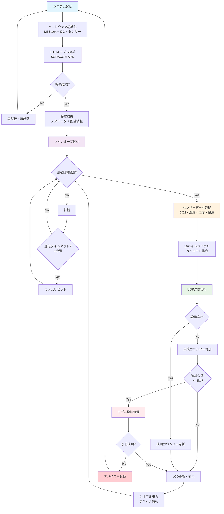

# M5Stack CO2 Monitor システムフロー

このファイルは src/main.cpp の処理フローを抽象化して1ページで表現しています。

## システム全体フロー

```mermaid
flowchart TD
    A[システム起動] --> B[ハードウェア初期化<br/>M5Stack + I2C + センサー]
    B --> C[LTE-M モデム接続<br/>SORACOM APN]
    C --> D{接続成功?}
    D -->|No| E[再試行・再起動]
    D -->|Yes| F[設定取得<br/>メタデータ + 回線情報]
    F --> G[メインループ開始]
    
    G --> H{測定間隔経過?}
    H -->|No| I[待機]
    I --> J{通信タイムアウト?<br/>5分間}
    J -->|Yes| K[モデムリセット]
    J -->|No| H
    K --> H
    
    H -->|Yes| L[センサーデータ取得<br/>CO2・温度・湿度・風速]
    L --> M[16バイトバイナリ<br/>ペイロード作成]
    M --> N[UDP送信実行]
    N --> O{送信成功?}
    
    O -->|Yes| P[成功カウンター更新]
    O -->|No| Q[失敗カウンター増加]
    Q --> R{連続失敗<br/>>= 3回?}
    R -->|Yes| S[モデム復旧処理]
    R -->|No| T[LCD更新・表示]
    
    P --> T
    S --> U{復旧成功?}
    U -->|No| V[デバイス再起動]
    U -->|Yes| T
    
    T --> W[シリアル出力<br/>デバッグ情報]
    W --> H
    
    E --> A
    V --> A
    
    style A fill:#e1f5fe
    style G fill:#f3e5f5
    style L fill:#fff3e0
    style N fill:#e8f5e8
    style S fill:#ffebee
    style V fill:#ffcdd2
```